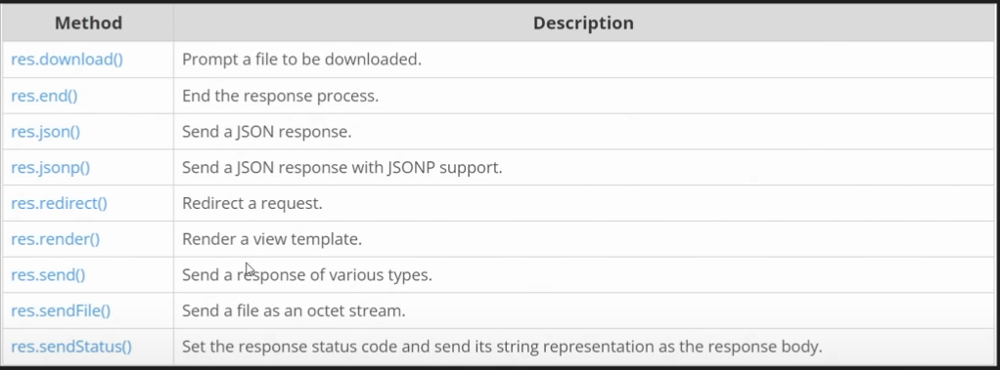

# Express JS


### What is Express.js? 🖥️
- Express.js is a minimal and flexible web application framework for Node.js. It provides a robust set of features for building web and mobile applications. With Express.js, developers can easily manage server configurations, create routes, and handle HTTP requests and responses.


---
## Advanced Express.js Application Example

### Code:
```javascript
const express = require('express');
const app = express();
const port = 3000;

// Serve static files from the 'public' directory
app.use(express.static('public'));

// Define routes
app.get('/', (req, res) => {
    res.send('Hello World!');
});

app.get('/about', (req, res) => {
    res.send('About us');
});

app.get('/contact', (req, res) => {
    res.send('Hello contact me!');
});

app.get('/blog', (req, res) => {
    res.send('Hello blog!');
});

app.get('/blog/:slug', (req, res) => {
    // Logic to fetch {slug} from the database
    // For URL: http://localhost:3000/blog/intro-to-padosi?mode=dark&region=in
    console.log(req.params); // Outputs { slug: 'intro-to-padosi' }
    console.log(req.query); // Outputs { mode: 'dark', region: 'in' }

    res.send(`Hello ${req.params.slug}`);
});

// Start the server
app.listen(port, () => {
    console.log(`Example app listening on port ${port}`);
});
```

### Explanation:
- **Serve Static Files**: `app.use(express.static('public'));` serves static files like CSS, JS, or images from the `public` directory.
- **Define Routes**: Multiple routes handle different URLs:
  - `/`: Responds with "Hello World!"
  - `/about`: Responds with "About us"
  - `/contact`: Responds with "Hello contact me!"
  - `/blog`: Responds with "Hello blog!"
  - `/blog/:slug`: A dynamic route that captures the `slug` parameter from the URL, logs it, and optionally reads query parameters.
- **Dynamic Routing**: The `/blog/:slug` route demonstrates fetching the `slug` from the request URL and query parameters from the URL query string.
- **Start Server**: The application listens on port `3000` and logs a confirmation message when running.



# Handling HTTP Requests in Express.js

Express.js is a powerful web application framework for Node.js, widely used for building APIs and web applications. In this guide, we’ll explore how to handle different HTTP request methods (GET, POST, PUT, DELETE) with Express.js. We’ll also cover related concepts like serving static files, organizing routes, and API testing with Postman.

---

## HTTP Request Methods

### 1. GET Requests
GET requests are used to retrieve data from the server.

**Example:**
```javascript
const express = require('express');
const app = express();

app.get('/users', (req, res) => {
    res.send('List of users');
});

app.listen(3000, () => {
    console.log('Server running on port 3000');
});
```

### 2. POST Requests
POST requests are used to send data to the server, commonly for creating resources.

**Example:**
```javascript
app.use(express.json()); // Middleware to parse JSON

app.post('/users', (req, res) => {
    const newUser = req.body;
    res.send(`User ${newUser.name} added successfully!`);
});
```

**Why POST for sensitive data?**
POST requests send data in the request body, making it less exposed than GET requests, where data is visible in the URL.

### 3. PUT Requests
PUT requests are used to update existing resources.

**Example:**
```javascript
app.put('/users/:id', (req, res) => {
    const userId = req.params.id;
    const updatedData = req.body;
    res.send(`User ${userId} updated with data: ${JSON.stringify(updatedData)}`);
});
```

### 4. DELETE Requests
DELETE requests are used to remove resources from the server.

**Example:**
```javascript
app.delete('/users/:id', (req, res) => {
    const userId = req.params.id;
    res.send(`User ${userId} deleted successfully!`);
});
```

---

## Additional Concepts

### Chaining Request Handlers
In Express, you can chain multiple handlers for a single route to keep your code organized.

**Example:**
```javascript
const validateRequest = (req, res, next) => {
    console.log('Request validated');
    next();
};

app.get('/products', validateRequest, (req, res) => {
    res.send('List of products');
});
```

### Serving Static Files
You can serve static files like HTML, CSS, and JavaScript using the `express.static` middleware.

**Example:**
```javascript
app.use(express.static('public'));

// Place your static files (e.g., index.html) inside the 'public' folder.
```

### Organizing Routes
To improve maintainability, separate routes into different files.

**Example:**
```javascript
// routes/users.js
const express = require('express');
const router = express.Router();

router.get('/', (req, res) => {
    res.send('List of users');
});

module.exports = router;

// app.js
const usersRouter = require('./routes/users');
app.use('/users', usersRouter);
```

---

## API Testing with Postman
Postman is a powerful tool for testing APIs. It allows you to:
- Send requests to your API endpoints.
- View responses.
- Debug and analyze errors.

**Steps:**
1. Install Postman.
2. Create a new request (e.g., GET, POST, PUT, DELETE).
3. Specify the endpoint and parameters.
4. View the response.

---

## Key Takeaways
- Use **GET** for retrieving data, **POST** for sending sensitive data, **PUT** for updating, and **DELETE** for removing resources.
- Serve static files using `express.static`.
- Organize routes into separate files for scalability.
- Use Postman for efficient API testing.

This guide provides a simple and practical overview to help you get started with Express.js and HTTP request handling!

## Middleware in Express.js (Simple Explanation)

Middleware in Express.js is like a *helper function* that runs between a user's request and the server's response. It is used to modify requests or responses, handle errors, or add functionality like logging or authentication.

---

### Key Points About Middleware:
1. **Functionality**: Middleware functions can:
   - Access request (`req`) and response (`res`) objects.
   - Perform tasks like logging, validating data, or modifying requests.
   - Decide whether to pass control to the next middleware function.

2. **`next()` Function**: Middleware functions must call `next()` to pass control to the next middleware in the stack. If `next()` is not called, the request will hang.

3. **Types of Middleware**:
   - **Built-in Middleware**: Comes with Express, e.g., `express.json()` for parsing JSON data.
   - **Third-Party Middleware**: Installed via npm, e.g., `cors` for enabling Cross-Origin Resource Sharing.
   - **Custom Middleware**: Functions you write yourself.

---

### Example:
```javascript
const express = require('express');
const app = express();
const port = 3000;

// Custom middleware to log requests
const logger = (req, res, next) => {
    console.log(`Request Method: ${req.method}, URL: ${req.url}`);
    next(); // Pass control to the next middleware or route handler
};

// Use the middleware for every request
app.use(logger);

// Define routes
app.get('/', (req, res) => {
    res.send('Hello, this is the home page!');
});

app.get('/about', (req, res) => {
    res.send('Welcome to the About page!');
});

// Start the server
app.listen(port, () => {
    console.log(`Server running on http://localhost:${port}`);
});
```

---

### What Happens Here?
1. **Middleware (Logger)**: Logs the request method and URL for every incoming request.
2. **Routes**: After the middleware, the control goes to the route handlers like `/` or `/about`.

---

### Why Use Middleware?
- **Request Parsing**: Parse JSON or form data.
- **Security**: Validate user authentication or sanitize inputs.
- **Error Handling**: Handle errors gracefully.
- **Logging**: Track all incoming requests.

Middleware makes your Express.js app more modular, flexible, and easier to maintain! ✨

---

- There are five types of middelware:
    - Application-level middleware
    - Router-level middleware
    - Error-handling middleware
    - Built-in middleware
    - Third-party middleware


For more knowlage and types of middelware: https://expressjs.com/en/guide/using-middleware.html

---

# EJS (Embedded JavaScript)
EJS (Embedded JavaScript) is a simple templating engine for Node.js that is used in Express.js to generate dynamic HTML pages. It allows you to embed JavaScript code inside HTML, making it easy to display dynamic data (like user information, products, etc.) on web pages.

Here’s a simple breakdown:

1. **What is EJS?**  
   EJS is a templating engine that lets you create HTML pages with embedded JavaScript. It is similar to other templating engines like Handlebars or Pug, but it uses regular HTML syntax with embedded JavaScript.

2. **How does it work in Express?**  
   In an Express app, EJS is used to render HTML pages by replacing dynamic data (like variables or loops) with actual content when requested by the user.

3. **How to use EJS in Express?**  
   - **Step 1: Install EJS**
     You first need to install EJS in your Node.js project:
     ```bash
     npm install ejs
     ```

   - **Step 2: Set up EJS in your Express app**
     You need to set EJS as the view engine in your Express app:
     ```javascript
     const express = require('express');
     const app = express();
     app.set('view engine', 'ejs');
     ```

   - **Step 3: Create an EJS file**
     Create a `.ejs` file where you write HTML and embed JavaScript using `<%= %>` for inserting data. For example:
     ```html
     <!-- views/index.ejs -->
     <h1>Hello, <%= name %>!</h1>
     ```

   - **Step 4: Render the EJS template**
     In your route, you can pass data to the EJS template to render it dynamically:
     ```javascript
     app.get('/', (req, res) => {
       const userName = 'John';
       res.render('index', { name: userName });
     });
     ```

     In this example, EJS replaces `<%= name %>` with `John`, and the final output sent to the browser would be:
     ```html
     <h1>Hello, John!</h1>
     ```

4. **Why use EJS?**
   - **Dynamic Content:** EJS lets you insert dynamic data into your web pages, making it easier to display different content based on user input or server data.
   - **Reusability:** You can create partials (reusable parts of a page like headers or footers) and include them in different pages.
   - **Simple Syntax:** EJS is easy to learn because it uses regular HTML with embedded JavaScript.

In short, EJS makes it easy to create dynamic web pages in Express by combining HTML and JavaScript! ✨

For more knowlage go to :   https://github.com/mde/ejs/wiki/Using-EJS-with-Express , https://ejs.co/#docs